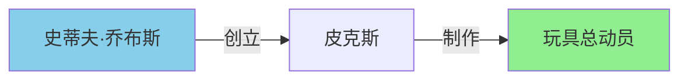

## 1. 引言：为什么传统 RAG 不够了？

检索增强生成（RAG）技术在 2023-2025 年间迅速普及，成为企业级 LLM 应用的标配架构。然而，随着应用场景深入，传统 RAG 的局限性日益凸显。

### 1.1 传统 RAG 的三大痛点

| 痛点 | 表现 | 影响 |
|:---|:---|:---|
| 信息孤岛 | 跨文档信息无法关联 | 无法回答复杂问题 |
| 语义模糊 | 向量相似度 ≠ 语义相关 | 检索结果不精准 |
| 缺乏推理 | 只能检索，不能推理 | 无法多跳查询 |

> 📌 **典型场景**：用户问"史蒂夫·乔布斯创立的公司制作了哪些动画电影？"

传统 RAG 的处理流程：
1. 将查询向量化
2. 在向量数据库中搜索相似文档
3. 返回最相似的 N 个片段
4. LLM 基于片段生成答案

**问题在于**：这个查询需要**多跳推理**——先找到乔布斯创立的公司（皮克斯），再找到皮克斯制作的动画电影。传统 RAG 只能找到语义相似的片段，无法建立这种跨文档的因果链。

### 1.2 Graph RAG 的核心突破

Graph RAG 通过引入知识图谱，实现三个关键突破：

| 突破 | 说明 |
|:---|:---|
| **结构化表示** | 实体为节点，关系为边，将非结构化文本转化为结构化知识网络 |
| **拓扑推理** | 利用图谱结构实现多步推理，通过关系边"跳转"到相关知识节点 |
| **社区摘要** | 自动检测知识社区并生成摘要，提升检索效率和准确性 |

> 📈 **微软实测数据**：Graph RAG 在复杂查询场景下，检索准确率提升 **30-50%**

### 1.3 技术演进路线

```
Naive RAG (2023) → Advanced RAG (2024-2025) → Graph RAG (2026)
    ↓                    ↓                        ↓
向量检索          + 查询改写/重排序        + 知识图谱/多跳推理
```

Graph RAG 不是替代传统 RAG，而是在其基础上叠加图谱能力，形成更强大的混合检索架构。

---

## 2. Graph RAG 核心原理

> 理解原理，才能玩转技术

### 2.1 架构概览

Graph RAG 核心架构分为两个阶段：**索引阶段**和**查询阶段**。

**索引阶段**：

```
┌─────────────────────────────────────────────────────────────┐
│                     Graph RAG 架构                          │
├─────────────────────────────────────────────────────────────┤
│  索引阶段                                                    │
│  ┌─────────────┐  ┌─────────────┐  ┌─────────────┐        │
│  │ 文档分块    │→ │ 实体关系抽取 │→ │ 图谱构建    │        │
│  └─────────────┘  └─────────────┘  └─────────────┘        │
│                          ↓                                  │
│  ┌─────────────────────────────────────────────────────┐   │
│  │              社区检测 + 社区摘要生成                  │   │
│  └─────────────────────────────────────────────────────┘   │
└─────────────────────────────────────────────────────────────┘
```

| 步骤 | 说明 |
|:---|:---|
| 1️⃣ 文档分块 | 将文档切分为适合处理的文本块（通常 300-500 tokens） |
| 2️⃣ 实体关系抽取 | 使用 LLM 从文本块中抽取实体和关系 |
| 3️⃣ 图谱构建 | 将实体和关系存储到图数据库 |
| 4️⃣ 社区检测 | 使用 Leiden/Louvain 算法发现知识社区 |
| 5️⃣ 社区摘要 | 为每个社区生成结构化摘要 |

**查询阶段**：

```
┌─────────────────────────────────────────────────────────────┐
│  查询阶段                                                    │
│  ┌─────────────┐  ┌─────────────┐  ┌─────────────┐        │
│  │ 查询理解    │→ │ 图谱检索    │→ │ 答案生成    │        │
│  └─────────────┘  └─────────────┘  └─────────────┘        │
│                          ↓                                  │
│  ┌─────────────────────────────────────────────────────┐   │
│  │           多跳推理 + 证据链追溯                       │   │
│  └─────────────────────────────────────────────────────┘   │
└─────────────────────────────────────────────────────────────┘
```

| 步骤 | 说明 |
|:---|:---|
| 1️⃣ 查询理解 | 解析用户意图，识别查询中的实体和关系 |
| 2️⃣ 图谱检索 | 在知识图谱中定位相关实体和社区 |
| 3️⃣ 多跳推理 | 沿关系边遍历，构建证据链 |
| 4️⃣ 答案生成 | 基于证据链生成最终答案 |

### 2.2 与传统 RAG 的对比

| 维度 | 传统 RAG | Graph RAG |
|:---|:---|:---|
| 知识表示 | 向量嵌入 | 图结构（实体 + 关系） |
| 检索方式 | 相似度搜索 | 图遍历 + 社区检索 |
| 推理能力 | ❌ 无 | ✅ 多跳推理 |
| 可解释性 | 低 | 高（证据链可视化） |
| 跨文档关联 | ❌ 无 | ✅ 有 |
| 构建成本 | 低 | 中高 |
| 查询延迟 | 低 | 中 |

---

## 3. 实战一：使用 Microsoft Graph RAG

> 微软开源方案，最成熟的 Graph RAG 实现

微软在 2024 年开源了 Graph RAG 实现，是目前最成熟的方案之一。

### 3.1 环境搭建

```bash
# 安装 Graph RAG
pip install graphrag

# 创建项目目录
mkdir graphrag_quickstart && cd graphrag_quickstart

# 初始化项目（会创建 settings.yaml 和 .env 文件）
graphrag init

# 项目结构
# ./graphrag_quickstart/
# ├── settings.yaml        # 配置文件（新版使用 YAML 格式）
# ├── input/               # 输入文档目录
# ├── output/              # 索引输出
# └── .env                 # 环境变量
```

> ⚠️ **注意**：Graph RAG 在 2024 年开源后持续迭代，API 可能有所变化。本文基于 2025 年版本，建议参考[官方文档](https://microsoft.github.io/graphrag/)获取最新用法。

**配置文件** `settings.yaml`（核心配置示例）：

```yaml
models:
  default_chat_model:
    model: gpt-4-turbo
    api_key: ${GRAPHRAG_API_KEY}
  default_embedding_model:
    model: text-embedding-3-small

chunks:
  size: 300
  overlap: 100

embeddings:
  vector_store:
    type: lancedb

entity_extraction:
  max_gleanings: 1

community_reports:
  max_length: 1500
```

### 3.2 索引构建

将待索引的文档放入 `input/` 目录（支持 `.txt` 或 `.csv` 格式），然后运行索引：

```bash
# 执行索引
graphrag index
```

**命令行方式**（推荐）：

```bash
# Global Search：全局查询，使用社区摘要
graphrag query "What are the main themes in this story?"

# Local Search：局部查询，针对特定实体
graphrag query \
  "Who is Scrooge and what are his main relationships?" \
  --method local
```

**Python API 方式**：

```python
# 使用 graphrag API 进行查询（需要安装 graphrag-api）
# 注意：具体 API 可能随版本变化，请参考官方文档

from graphrag.query.structured_search.local_search import LocalSearch
from graphrag.query.structured_search.global_search import GlobalSearch
from graphrag.vector_stores.lancedb import LanceDBVectorStore

# 加载索引后的数据
# ... 具体实现请参考官方示例
```

索引完成后，会在 `output/` 目录生成以下文件：
- `create_final_nodes.parquet`：实体节点
- `create_final_edges.parquet`：关系边
- `create_final_entities.parquet`：实体详情
- `create_final_communities.parquet`：社区信息
- `create_final_community_reports.parquet`：社区摘要

### 3.3 查询执行

Graph RAG 支持两种查询模式：

**Global Search**：针对整个知识图谱的全局查询，使用社区摘要。

```python
from graphrag.query import GraphRAGQuery

# 初始化查询引擎
query_engine = GraphRAGQuery(
    index_dir="./my_graph_rag/output",
    config_path="./config.yaml"
)

# 执行全局查询
response = query_engine.query(
    "史蒂夫·乔布斯创立的公司制作了哪些动画电影？",
    search_type="global"
)

print(response.answer)
# 输出：皮克斯制作了《玩具总动员》《海底总动员》等经典动画电影。
# 证据链：乔布斯 → 收购 → 皮克斯 → 制作 → 动画电影
```

**Local Search**：针对特定实体的局部查询，使用实体和关系。

```python
# 执行局部查询（针对特定实体）
response = query_engine.query(
    "皮克斯制作了哪些电影？",
    search_type="local"
)

print(response.answer)
# 输出：《玩具总动员》《海底总动员》等
```

---

## 4. 实战二：自建 Graph RAG 系统

> 掌握核心组件，自己动手构建

如果需要更灵活的控制，可以基于开源组件自建 Graph RAG 系统。

### 4.1 技术栈选择

| 组件 | 推荐方案 | 替代方案 | 说明 |
|------|----------|----------|------|
| 图数据库 | **NebulaGraph** | Neo4j / TigerGraph | 开源分布式，性能优秀 |
| 实体抽取 | spaCy + LLM | Stanza / 哈工大 LTP | 准确率高 |
| 关系抽取 | LLM Few-shot | REBEL / GoLLIE | 灵活性好 |
| 向量存储 | **LanceDB** | Milvus / Qdrant | 轻量级，易部署 |
| 社区检测 | **Leiden** | Louvain | 社区质量更好 |
| LLM | GPT-4 / Claude | DeepSeek / GLM-4 | 实体关系抽取质量关键 |

### 4.2 实体关系抽取

使用 LLM 进行实体关系抽取是 Graph RAG 的核心：

```python
from typing import List, Tuple
from pydantic import BaseModel
from openai import OpenAI

class Entity(BaseModel):
    """实体模型"""
    name: str           # 实体名称
    type: str           # 实体类型（人名、组织、地点等）
    description: str    # 实体描述

class Relationship(BaseModel):
    """关系模型"""
    source: str         # 源实体
    target: str         # 目标实体
    type: str           # 关系类型
    description: str    # 关系描述

class KnowledgeGraph(BaseModel):
    """知识图谱模型"""
    entities: List[Entity]
    relationships: List[Relationship]

def extract_knowledge_graph(text: str, llm: OpenAI) -> KnowledgeGraph:
    """使用 LLM 从文本中抽取知识图谱"""
    
    prompt = f"""
    你是一个专业的知识图谱构建助手。请从以下文本中抽取实体和关系。

    文本：
    {text}

    要求：
    1. 识别所有重要实体（人名、组织、地点、事件、概念等）
    2. 抽取实体之间的语义关系
    3. 为每个实体和关系提供简洁描述

    返回 JSON 格式：
    {{
        "entities": [
            {{"name": "实体名", "type": "类型", "description": "描述"}}
        ],
        "relationships": [
            {{"source": "源实体", "target": "目标实体", "type": "关系类型", "description": "描述"}}
        ]
    }}
    """
    
    response = llm.chat.completions.create(
        model="gpt-4-turbo",
        messages=[{"role": "user", "content": prompt}],
        response_format={"type": "json_object"}
    )
    
    return KnowledgeGraph.model_validate_json(response.choices[0].message.content)

# 使用示例
llm = OpenAI(api_key="your-api-key")

text = """
苹果公司由史蒂夫·乔布斯、史蒂夫·沃兹尼亚克和罗纳德·韦恩于 1976 年创立。
1985 年，乔布斯离开苹果，创立了 NeXT 公司。1997 年，苹果收购 NeXT，
乔布斯回归苹果并成为 CEO。
"""

kg = extract_knowledge_graph(text, llm)

print(f"抽取到 {len(kg.entities)} 个实体，{len(kg.relationships)} 条关系")
```

### 4.3 图谱存储（NebulaGraph）

使用 NebulaGraph 存储知识图谱：

```python
from nebula3.gclient.net import ConnectionPool
from nebula3.Config import Config

# 连接图数据库
config = Config()
config.max_connection_pool_size = 10
connection_pool = ConnectionPool()
connection_pool.init([('127.0.0.1', 9669)], config)

session = connection_pool.get_session('root', 'password')

# 创建 Schema
def init_schema(session):
    """初始化图数据库 Schema"""
    
    # 创建图空间
    session.execute('''
        CREATE SPACE IF NOT EXISTS knowledge_graph(
            vid_type=FIXED_STRING(256),
            partition_num=10,
            replica_factor=1
        )
    ''')
    
    session.execute('USE knowledge_graph')
    
    # 创建实体标签（Tag）
    session.execute('''
        CREATE TAG IF NOT EXISTS entity(
            name string,
            type string,
            description string,
            embedding string  # 向量嵌入（JSON 格式）
        )
    ''')
    
    # 创建关系边类型
    session.execute('''
        CREATE EDGE IF NOT EXISTS relationship(
            type string,
            description string,
            weight double
        )
    ''')
    
    # 创建索引
    session.execute('CREATE TAG INDEX IF NOT EXISTS entity_name_index ON entity(name(256))')
    session.execute('CREATE TAG INDEX IF NOT EXISTS entity_type_index ON entity(type(64))')

# 插入实体
def insert_entities(session, kg: KnowledgeGraph):
    """批量插入实体"""
    for entity in kg.entities:
        # 转义特殊字符
        safe_name = entity.name.replace('"', '\\"')
        safe_desc = entity.description.replace('"', '\\"')
        
        nGql = f'''
            INSERT VERTEX entity(name, type, description) 
            VALUES "{safe_name}":("{safe_name}", "{entity.type}", "{safe_desc}")
        '''
        session.execute(nGql)

# 插入关系
def insert_relationships(session, kg: KnowledgeGraph):
    """批量插入关系"""
    for rel in kg.relationships:
        safe_src = rel.source.replace('"', '\\"')
        safe_tgt = rel.target.replace('"', '\\"')
        safe_type = rel.type.replace('"', '\\"')
        safe_desc = rel.description.replace('"', '\\"')
        
        nGql = f'''
            INSERT EDGE relationship(type, description, weight) 
            VALUES "{safe_src}"->"{safe_tgt}":("{safe_type}", "{safe_desc}", 1.0)
        '''
        session.execute(nGql)

# 执行导入
init_schema(session)
insert_entities(session, kg)
insert_relationships(session, kg)
```

### 4.4 社区检测与摘要

社区检测是 Graph RAG 的关键创新，能自动发现知识图谱中的主题聚类：

```python
import networkx as nx
from community import community_louvain
from openai import OpenAI
from typing import Dict, List

def build_networkx_graph(kg: KnowledgeGraph) -> nx.Graph:
    """将知识图谱转换为 NetworkX 图"""
    G = nx.Graph()
    
    # 添加节点
    for entity in kg.entities:
        G.add_node(
            entity.name,
            type=entity.type,
            description=entity.description
        )
    
    # 添加边
    for rel in kg.relationships:
        G.add_edge(
            rel.source,
            rel.target,
            type=rel.type,
            description=rel.description
        )
    
    return G

def detect_communities(G: nx.Graph, resolution: float = 1.0) -> Dict[int, List[str]]:
    """使用 Louvain 算法检测社区"""
    
    # 执行社区检测
    partition = community_louvain.best_partition(G, resolution=resolution)
    
    # 按社区分组节点
    communities = {}
    for node, comm_id in partition.items():
        if comm_id not in communities:
            communities[comm_id] = []
        communities[comm_id].append(node)
    
    return communities

def generate_community_summary(
    community_nodes: List[str],
    G: nx.Graph,
    llm: OpenAI
) -> str:
    """为社区生成摘要"""
    
    # 收集社区内的实体和关系描述
    entity_descs = []
    for node in community_nodes:
        desc = G.nodes[node].get('description', '')
        entity_type = G.nodes[node].get('type', '')
        entity_descs.append(f"- [{entity_type}] {node}: {desc}")
    
    # 收集社区内的关系
    relationship_descs = []
    for u, v in G.edges(community_nodes):
        if u in community_nodes and v in community_nodes:
            rel = G.edges[u, v].get('type', '')
            rel_desc = G.edges[u, v].get('description', '')
            relationship_descs.append(f"- {u} --[{rel}]--> {v}: {rel_desc}")
    
    context = f"""
    实体列表：
    {chr(10).join(entity_descs)}
    
    关系列表：
    {chr(10).join(relationship_descs)}
    """
    
    prompt = f"""
    以下是知识图谱中一个社区的相关信息，请生成一个简洁的社区摘要（200 字以内），
    总结这个社区的核心主题和关键信息：
    
    {context}
    
    摘要：
    """
    
    response = llm.chat.completions.create(
        model="gpt-4-turbo",
        messages=[{"role": "user", "content": prompt}]
    )
    
    return response.choices[0].message.content

# 执行社区检测和摘要生成
G = build_networkx_graph(kg)
communities = detect_communities(G)

summaries = {}
for comm_id, nodes in communities.items():
    summaries[comm_id] = generate_community_summary(nodes, G, llm)
    print(f"社区 {comm_id} ({len(nodes)} 个实体): {summaries[comm_id][:50]}...")
```

---

## 5. 实战三：多跳查询与推理

> Graph RAG 的核心优势，复杂问题的克星

Graph RAG 的核心优势在于支持复杂的多跳查询。

### 5.1 查询分解

将复杂查询分解为多跳子查询：

```python
from typing import List
from openai import OpenAI
import json

def decompose_query(query: str, llm: OpenAI) -> List[str]:
    """将复杂查询分解为多跳子查询"""
    
    prompt = f"""
    你是一个查询分析专家。请将以下复杂问题分解为多个简单的子问题，
    每个子问题可以通过单跳图谱查询回答。
    
    原则：
    1. 子问题按执行顺序排列
    2. 后续子问题可以引用前面的结果
    3. 每个子问题应该明确、具体
    
    原问题：{query}
    
    返回 JSON 格式：
    {{
        "sub_queries": ["子问题1", "子问题2", ...]
    }}
    """
    
    response = llm.chat.completions.create(
        model="gpt-4-turbo",
        messages=[{"role": "user", "content": prompt}],
        response_format={"type": "json_object"}
    )
    
    result = json.loads(response.choices[0].message.content)
    return result["sub_queries"]

# 示例
query = "史蒂夫·乔布斯创立的公司制作了哪些动画电影？"
sub_queries = decompose_query(query, llm)

print("子查询分解：")
for i, sq in enumerate(sub_queries, 1):
    print(f"  {i}. {sq}")

# 输出：
# 子查询分解：
#   1. 史蒂夫·乔布斯创立了哪些公司？
#   2. 这些公司中哪些制作动画电影？
#   3. 它们具体制作了哪些动画电影？
```

### 5.2 图谱遍历

执行多跳图谱查询：

```python
from typing import List, Tuple

def multi_hop_query(
    session,
    start_entity: str,
    hops: List[Tuple[str, str]],  # [(关系类型, 目标实体类型), ...]
) -> Tuple[List[str], List[str]]:
    """执行多跳图谱查询
    
    Args:
        session: NebulaGraph session
        start_entity: 起始实体
        hops: 跳转列表，每跳包含 (关系类型, 目标实体类型)
    
    Returns:
        (结果实体列表, 证据链)
    """
    
    current_entities = [start_entity]
    evidence_chain = [start_entity]
    relationships = []
    
    for rel_type, target_type in hops:
        # 构建 nGql 查询
        entity_list = ', '.join([f'"{e}"' for e in current_entities])
        
        nGql = f'''
            MATCH (source:entity)-[r:relationship]->(target:entity)
            WHERE source.name IN [{entity_list}] 
              AND r.type == "{rel_type}"
              AND target.type == "{target_type}"
            RETURN target.name, r.type
        '''
        
        result = session.execute(nGql)
        
        if not result.is_succeeded():
            break
        
        # 提取结果
        next_entities = []
        for row in result.rows():
            entity_name = row.values[0].get_s()
            rel = row.values[1].get_s()
            next_entities.append(entity_name)
            relationships.append(rel)
        
        current_entities = list(set(next_entities))  # 去重
        evidence_chain.extend(current_entities)
    
    return current_entities, evidence_chain

# 使用示例
results, chain = multi_hop_query(
    session,
    start_entity="史蒂夫·乔布斯",
    hops=[
        ("创立", "组织"),      # 第一跳：找创立的组织
        ("制作", "作品")       # 第二跳：找制作的作品
    ]
)

print(f"结果：{results}")
print(f"证据链：{' → '.join(chain)}")

# 输出：
# 结果：['玩具总动员', '海底总动员', ...]
# 证据链：史蒂夫·乔布斯 → 皮克斯 → 玩具总动员
```

### 5.3 证据链可视化

生成可解释的证据链：

```python
import graphviz

def visualize_evidence_chain(
    evidence_chain: List[str],
    relationships: List[str],
    output_path: str = "evidence_chain"
) -> str:
    """生成证据链可视化图"""
    
    dot = graphviz.Digraph('Evidence Chain', comment='Multi-hop Query Evidence')
    dot.attr(rankdir='LR')  # 从左到右布局
    dot.attr('node', shape='box', style='rounded', fontname='Arial')
    dot.attr('edge', fontname='Arial')
    
    # 添加节点
    for i, entity in enumerate(evidence_chain):
        if i == 0:
            # 起始节点高亮
            dot.node(f"e{i}", entity, style='filled', fillcolor='lightblue')
        elif i == len(evidence_chain) - 1:
            # 终点节点高亮
            dot.node(f"e{i}", entity, style='filled', fillcolor='lightgreen')
        else:
            dot.node(f"e{i}", entity)
    
    # 添加边
    for i, rel in enumerate(relationships):
        dot.edge(f"e{i}", f"e{i+1}", label=rel, color='#666666')
    
    # 渲染输出
    dot.render(output_path, format='svg', cleanup=True)
    
    return f"{output_path}.svg"

# 使用示例
svg_path = visualize_evidence_chain(
    evidence_chain=["史蒂夫·乔布斯", "皮克斯", "玩具总动员"],
    relationships=["创立", "制作"],
    output_path="./evidence_chain_example"
)

print(f"证据链可视化已生成: {svg_path}")
```

生成的可视化效果：



---

## 6. 生产环境部署

> 评估融入开发流程，打造生产级系统

### 6.1 性能优化策略

| 优化点 | 方案 | 效果 | 实施难度 |
|--------|------|------|----------|
| 索引并行化 | 多进程分片处理 | 速度提升 3-5x | ⭐⭐ |
| 社区预计算 | 离线生成社区摘要 | 查询延迟降低 60% | ⭐⭐⭐ |
| 缓存策略 | Redis 缓存热点查询 | 命中率 70%+ | ⭐⭐ |
| 增量更新 | 只更新变更部分 | 更新速度提升 10x | ⭐⭐⭐⭐ |
| 向量索引 | HNSW 索引 | 检索速度提升 5x | ⭐⭐⭐ |

**索引并行化示例**：

```python
from concurrent.futures import ThreadPoolExecutor, as_completed
from typing import List, Dict
import threading

class ParallelIndexer:
    """并行索引器"""
    
    def __init__(self, max_workers: int = 4):
        self.max_workers = max_workers
        self.lock = threading.Lock()
        self.stats = {"processed": 0, "failed": 0}
    
    def process_chunk(self, chunk: List[Dict], llm: OpenAI) -> KnowledgeGraph:
        """处理单个文档块"""
        kg = KnowledgeGraph(entities=[], relationships=[])
        
        for doc in chunk:
            try:
                chunk_kg = extract_knowledge_graph(doc["text"], llm)
                kg.entities.extend(chunk_kg.entities)
                kg.relationships.extend(chunk_kg.relationships)
            except Exception as e:
                with self.lock:
                    self.stats["failed"] += 1
                continue
        
        with self.lock:
            self.stats["processed"] += len(chunk)
        
        return kg
    
    def index_documents(
        self,
        documents: List[Dict],
        llm: OpenAI,
        chunk_size: int = 10
    ) -> KnowledgeGraph:
        """并行索引文档"""
        
        # 分片
        chunks = [
            documents[i:i + chunk_size]
            for i in range(0, len(documents), chunk_size)
        ]
        
        # 并行处理
        final_kg = KnowledgeGraph(entities=[], relationships=[])
        
        with ThreadPoolExecutor(max_workers=self.max_workers) as executor:
            futures = {
                executor.submit(self.process_chunk, chunk, llm): i
                for i, chunk in enumerate(chunks)
            }
            
            for future in as_completed(futures):
                chunk_kg = future.result()
                final_kg.entities.extend(chunk_kg.entities)
                final_kg.relationships.extend(chunk_kg.relationships)
                
                chunk_id = futures[future]
                print(f"Chunk {chunk_id + 1}/{len(chunks)} completed")
        
        # 实体去重
        seen = set()
        unique_entities = []
        for e in final_kg.entities:
            if e.name not in seen:
                seen.add(e.name)
                unique_entities.append(e)
        
        final_kg.entities = unique_entities
        
        print(f"Indexing complete: {len(final_kg.entities)} entities, {len(final_kg.relationships)} relationships")
        return final_kg
```

### 6.2 监控指标

使用 Prometheus 监控 Graph RAG 系统：

```python
from prometheus_client import Counter, Histogram, Gauge, start_http_server
import time

# 定义监控指标
GRAPH_RAG_QUERY_TOTAL = Counter(
    'graph_rag_query_total',
    'Total number of Graph RAG queries',
    ['query_type', 'status']
)

GRAPH_RAG_QUERY_LATENCY = Histogram(
    'graph_rag_query_latency_seconds',
    'Graph RAG query latency in seconds',
    ['query_type'],
    buckets=[0.1, 0.5, 1.0, 2.0, 5.0, 10.0]
)

GRAPH_RAG_HOP_COUNT = Histogram(
    'graph_rag_hop_count',
    'Number of hops in Graph RAG query',
    buckets=[1, 2, 3, 4, 5]
)

GRAPH_RAG_ENTITIES_RETRIEVED = Histogram(
    'graph_rag_entities_retrieved',
    'Number of entities retrieved per query',
    buckets=[5, 10, 20, 50, 100, 200]
)

GRAPH_RAG_INDEX_SIZE = Gauge(
    'graph_rag_index_size',
    'Number of entities in the knowledge graph'
)

GRAPH_RAG_CACHE_HIT_RATE = Gauge(
    'graph_rag_cache_hit_rate',
    'Cache hit rate for Graph RAG queries'
)

# 装饰器：自动记录查询指标
def track_query_metrics(query_type: str):
    def decorator(func):
        def wrapper(*args, **kwargs):
            start_time = time.time()
            status = "success"
            
            try:
                result = func(*args, **kwargs)
                
                # 记录 hop 数量
                if hasattr(result, 'hop_count'):
                    GRAPH_RAG_HOP_COUNT.observe(result.hop_count)
                
                # 记录检索实体数
                if hasattr(result, 'entity_count'):
                    GRAPH_RAG_ENTITIES_RETRIEVED.observe(result.entity_count)
                
                return result
            except Exception as e:
                status = "error"
                raise
            finally:
                # 记录查询延迟
                latency = time.time() - start_time
                GRAPH_RAG_QUERY_LATENCY.labels(query_type=query_type).observe(latency)
                
                # 记录查询计数
                GRAPH_RAG_QUERY_TOTAL.labels(
                    query_type=query_type,
                    status=status
                ).inc()
        
        return wrapper
    return decorator

# 启动 Prometheus 服务
start_http_server(9090)
```

**关键监控告警规则**：

```yaml
# prometheus_rules.yml
groups:
  - name: graph_rag_alerts
    rules:
      - alert: HighQueryLatency
        expr: histogram_quantile(0.95, graph_rag_query_latency_seconds) > 5
        for: 5m
        labels:
          severity: warning
        annotations:
          summary: "Graph RAG 查询延迟过高"
          description: "P95 延迟超过 5 秒"
      
      - alert: LowCacheHitRate
        expr: graph_rag_cache_hit_rate < 0.3
        for: 10m
        labels:
          severity: warning
        annotations:
          summary: "Graph RAG 缓存命中率过低"
          description: "缓存命中率低于 30%"
      
      - alert: HighErrorRate
        expr: rate(graph_rag_query_total{status="error"}[5m]) / rate(graph_rag_query_total[5m]) > 0.1
        for: 5m
        labels:
          severity: critical
        annotations:
          summary: "Graph RAG 查询错误率过高"
          description: "错误率超过 10%"
```

### 6.3 成本估算

基于实际生产经验的成本估算：

| 规模 | 文档数 | 实体数 | 关系数 | 索引成本 | 查询成本 | 存储成本 |
|------|--------|--------|--------|----------|----------|----------|
| 小型 | 1K | 5K | 10K | $5/月 | $10/月 | $2/月 |
| 中型 | 10K | 50K | 100K | $50/月 | $100/月 | $20/月 |
| 大型 | 100K | 500K | 1M | $500/月 | $1000/月 | $200/月 |
| 企业 | 1M | 5M | 10M | $5000/月 | $10000/月 | $2000/月 |

**成本优化建议**：

1. **LLM 成本优化**：
   - 使用更便宜的模型做实体抽取（如 GPT-3.5、Claude Instant）
   - 批量处理文档，减少 API 调用次数
   - 缓存已抽取的实体，避免重复抽取

2. **存储成本优化**：
   - 定期清理过时知识
   - 压缩向量嵌入（如使用 PQ 量化）
   - 冷热数据分离存储

3. **查询成本优化**：
   - 实现智能缓存，命中率目标 70%+
   - 预计算热点社区摘要
   - 使用查询路由，简单查询不走图谱

---

## 7. 2026 年 Graph RAG 新趋势

> 把握前沿技术，赢得未来先机

### 7.1 Agentic RAG：智能体驱动的动态图谱

```
传统 Graph RAG              Agentic RAG
     ↓                          ↓
静态知识图谱    →    动态图谱构建
预定义 Schema   →    自动 Schema 发现
批量索引       →    实时增量更新
被动查询       →    主动知识推送
```

**Agentic RAG 特点**：
- 智能体根据任务需求动态构建子图
- 自动发现和补充缺失的知识节点
- 支持多智能体协作的知识融合

### 7.2 多模态 Graph RAG

```
文本 ────┐
图像 ────┼──→ 统一知识图谱 ──→ 多模态推理
视频 ────┤
音频 ────┘
```

**应用场景**：
- 医疗影像 + 病历文本联合诊断
- 产品图片 + 描述文本智能检索
- 视频 + 字幕语义对齐

### 7.3 流式图谱更新

```
传统：批量索引（小时级延迟）
    ↓
现代：增量更新（分钟级延迟）
    ↓
未来：流式更新（秒级延迟）
```

**技术栈**：
- 消息队列：Kafka / Pulsar
- 流处理：Flink / Spark Streaming
- 图数据库：支持实时写入的图数据库

### 7.4 联邦 Graph RAG

跨组织知识协作，在保护隐私的前提下实现知识共享：

```
组织 A 的图谱 ←─┐
               │
组织 B 的图谱 ←─┼──→ 联邦查询 ──→ 统一答案
               │
组织 C 的图谱 ←─┘
```

**核心技术**：
- 差分隐私
- 安全多方计算（MPC）
- 联邦学习

---

## 8. 总结

### Graph RAG 实施检查清单

**准备阶段**：
- [ ] 评估文档规模和复杂度
- [ ] 确定核心实体类型和关系类型
- [ ] 选择合适的技术栈
- [ ] 估算成本预算

**实施阶段**：
- [ ] 搭建图数据库环境
- [ ] 设计实体关系 Schema
- [ ] 实现实体关系抽取 Pipeline
- [ ] 实现社区检测和摘要生成
- [ ] 实现多跳查询引擎
- [ ] 集成缓存和监控

**优化阶段**：
- [ ] 性能基准测试
- [ ] 缓存策略优化
- [ ] 索引策略优化
- [ ] 监控告警配置

**运维阶段**：
- [ ] 定期更新知识图谱
- [ ] 监控查询质量和延迟
- [ ] 收集用户反馈持续改进

### 给架构师的建议

1. **不要盲目追求图谱规模**：图谱质量 > 图谱规模，小而精的图谱比大而全更有价值

2. **混合架构是最佳实践**：Graph RAG + 向量 RAG 混合检索，兼顾精度和召回

3. **关注增量更新能力**：生产环境的知识图谱需要持续更新，提前设计好增量更新机制

4. **投资可观测性**：证据链可视化是 Graph RAG 的杀手级特性，值得投入

5. **从垂直领域切入**：通用知识图谱构建成本高，建议从垂直领域开始，逐步扩展

Graph RAG 不是传统 RAG 的替代品，而是企业级知识管理的关键拼图。2026 年，掌握 Graph RAG 的团队将在企业 AI 应用中占据先发优势。

---

## 参考资料

- [Microsoft Graph RAG 官方仓库](https://github.com/microsoft/graphrag)
- [NebulaGraph Graph RAG 实践](https://segmentfault.com/a/1190000044291318)
- [Graph RAG 论文解读](https://arxiv.org/abs/2404.16130)
- [From Local to Global: A Graph RAG Approach](https://www.microsoft.com/en-us/research/project/graphrag/)

---

> 本文首发于 [L先生的博客](https://liu-aj.github.io)，转载请注明出处。